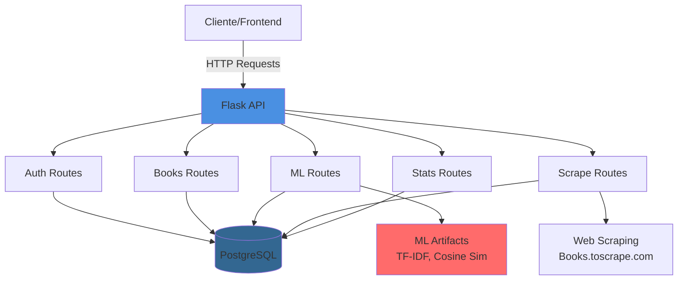
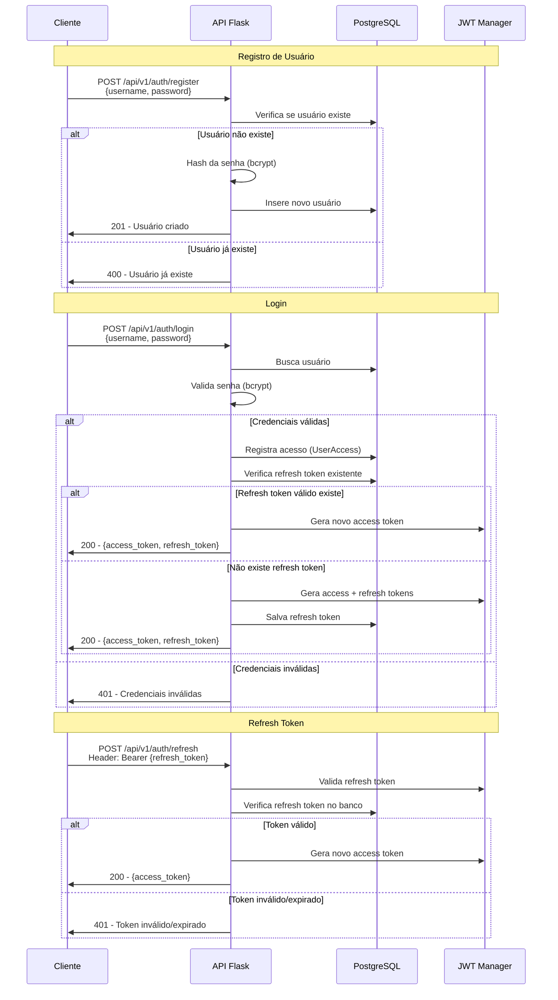
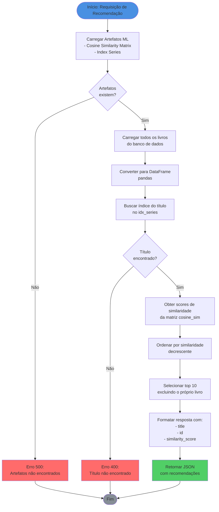
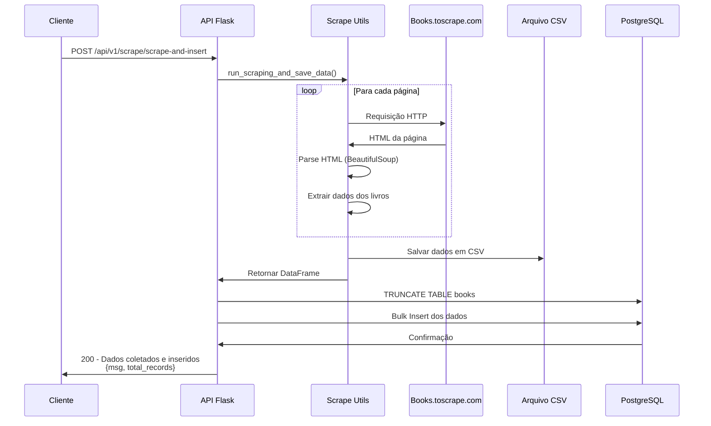
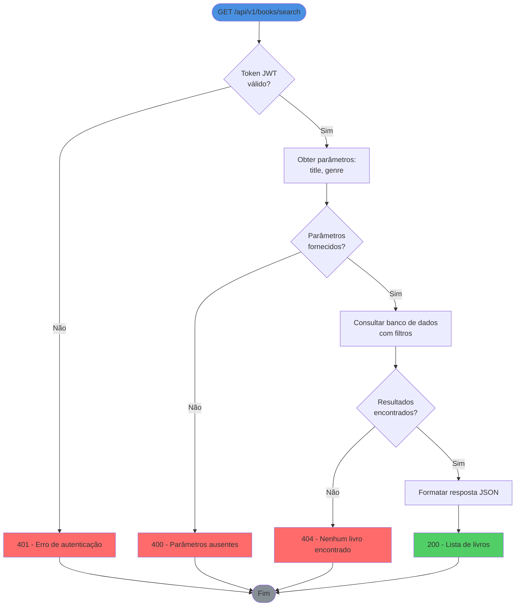

# 📚 API de Gerenciamento de Livros com Sistema de Recomendação ML

API REST desenvolvida em Flask para o Tech Challenge da Fase 1 da Pós-Graduação em Machine Learning Engineering da FIAP. A aplicação oferece funcionalidades de gerenciamento de livros, autenticação JWT, web scraping e um sistema de recomendação baseado em conteúdo usando Machine Learning.

## 🎯 Funcionalidades

- **Autenticação JWT**: Sistema completo de registro, login e refresh tokens
- **Gerenciamento de Livros**: CRUD completo com busca e filtros avançados
- **Web Scraping**: Coleta automática de dados de livros
- **Sistema de Recomendação ML**: Recomenda livros similares baseado em conteúdo (TF-IDF + Cosine Similarity)
- **Estatísticas**: Análise de dados dos livros cadastrados
- **Categorias**: Gerenciamento de categorias de livros

## 🏗️ Arquitetura



## 📊 Fluxos Principais

### 1. Fluxo de Autenticação



### 2. Fluxo de Recomendação ML



### 3. Fluxo de Treinamento do Modelo ML

```mermaid
flowchart LR
    Start([GET /api/v1/ml/training-data]) --> LoadBooks[Carregar livros<br/>do banco]
    LoadBooks --> CheckEmpty{DataFrame<br/>vazio?}
    CheckEmpty -->|Sim| ReturnEmpty[Retornar:<br/>Nenhum dado encontrado]
    CheckEmpty -->|Não| FillNA[Preencher descrições<br/>vazias com '']
    
    FillNA --> Tokenize[Aplicar tokenizer:<br/>- Normalizar acentos<br/>- Remover pontuação<br/>- Remover stopwords<br/>- Remover números]
    Tokenize --> FilterEmpty[Filtrar descrições<br/>vazias]
    
    FilterEmpty --> TFIDF[Aplicar TF-IDF<br/>Vectorizer]
    TFIDF --> CosineSim[Calcular Matriz de<br/>Similaridade do Cosseno]
    CosineSim --> CreateIndex[Criar índice<br/>title -> position]
    
    CreateIndex --> SaveArtifacts[Salvar Artefatos:<br/>- tfidf_vectorizer.pkl<br/>- cosine_sim_matrix.pkl<br/>- idx_series.pkl]
    SaveArtifacts --> ReturnSuccess[Retornar:<br/>- Mensagem de sucesso<br/>- Total de registros<br/>- Dados de treinamento]
    
    ReturnEmpty --> End([Fim])
    ReturnSuccess --> End
    
    style Start fill:#4A90E2
    style SaveArtifacts fill:#FFD93D
    style ReturnSuccess fill:#51CF66
    style End fill:#868E96
```



### 4. Fluxo de Web Scraping



### 5. Fluxo de Busca de Livros



## 🚀 Instalação

### Pré-requisitos

- Python 3.11+
- PostgreSQL
- Poetry (gerenciador de dependências)

### Passos

1. **Clone o repositório**
```bash
git clone <url-do-repositorio>
cd postech-ml-techchallenge-fase-1-api
```

2. **Instale as dependências**
```bash
poetry install
```

3. **Configure as variáveis de ambiente**
```bash
# Copie o arquivo de exemplo e configure
cp .env.example .env
```

Configure as seguintes variáveis no arquivo `.env`:
- `DATABASE_URL`: URL de conexão com PostgreSQL
- `JWT_SECRET_KEY`: Chave secreta para JWT
- `JWT_ACCESS_TOKEN_EXPIRES`: Tempo de expiração do access token
- `JWT_REFRESH_TOKEN_EXPIRES`: Tempo de expiração do refresh token

4. **Execute as migrações**
```bash
poetry run alembic upgrade head
```

5. **Inicie o servidor**
```bash
poetry run python app.py
```

A API estará disponível em `http://localhost:5000`

## 📁 Estrutura do Projeto

```
postech-ml-techchallenge-fase-1-api/
├── api/
│   ├── __init__.py              # Factory do Flask app
│   ├── config/
│   │   └── config.py            # Configurações da aplicação
│   ├── models/
│   │   ├── __init__.py          # Inicialização do SQLAlchemy
│   │   ├── books.py             # Modelo Books
│   │   ├── user.py              # Modelo User
│   │   ├── users_access.py      # Modelo UserAccess
│   │   └── refresh_token_manager.py  # Modelo RefreshTokenManager
│   ├── routes/
│   │   ├── auth.py              # Rotas de autenticação
│   │   ├── books.py             # Rotas de livros
│   │   ├── categories.py        # Rotas de categorias
│   │   ├── health.py            # Health check
│   │   ├── ml.py                # Rotas de ML
│   │   ├── scrape.py            # Rotas de scraping
│   │   └── stats.py             # Rotas de estatísticas
│   ├── scripts/
│   │   ├── books_utils.py       # Utilitários de livros
│   │   ├── ml_utils.py          # Utilitários de ML
│   │   ├── scrape_utils.py      # Utilitários de scraping
│   │   └── user_utils.py        # Utilitários de usuário
│   └── logs/
│       └── routes_middleware.py # Middleware de logging
├── migrations/                  # Migrações Alembic
├── tests/                       # Testes
├── data/
│   ├── books.csv                # Dados de livros
│   └── ml_artifacts/            # Artefatos de ML
├── app.py                       # Entry point
├── pyproject.toml               # Dependências Poetry
└── README.md                    # Este arquivo
```

## 🔧 Tecnologias Utilizadas

- **Flask**: Framework web
- **SQLAlchemy**: ORM para banco de dados
- **PostgreSQL**: Banco de dados relacional
- **Flask-JWT-Extended**: Autenticação JWT
- **Flask-Bcrypt**: Hash de senhas
- **Pandas**: Manipulação de dados
- **Scikit-learn**: Machine Learning (TF-IDF, Cosine Similarity)
- **BeautifulSoup4**: Web scraping
- **NLTK**: Processamento de linguagem natural
- **Flasgger**: Documentação Swagger
- **Alembic**: Migrações de banco de dados
- **Poetry**: Gerenciamento de dependências

## 📝 Endpoints Principais

### Autenticação
- `POST /api/v1/auth/register` - Registrar novo usuário
- `POST /api/v1/auth/login` - Login e obtenção de tokens
- `POST /api/v1/auth/refresh` - Renovar access token

### Livros
- `GET /api/v1/books/titles` - Listar todos os títulos
- `GET /api/v1/books/<id>` - Detalhes de um livro
- `GET /api/v1/books/search?title=&genre=` - Buscar livros
- `GET /api/v1/books/price-range?min=&max=` - Filtrar por preço
- `GET /api/v1/books/top-rated?limit=` - Top livros por avaliação

### Machine Learning
- `GET /api/v1/ml/training-data` - Treinar modelo e gerar artefatos
- `GET /api/v1/ml/predictions` - Obter recomendações de livros

### Web Scraping
- `POST /api/v1/scrape/scrape-and-insert` - Executar scraping e inserir dados

### Documentação
- `GET /apidocs` - Documentação Swagger interativa

## 🔐 Segurança

- Autenticação JWT com access e refresh tokens
- Hash de senhas com bcrypt
- Validação de tokens em rotas protegidas
- Middleware de logging de requisições

## 🧪 Testes

Execute os testes com:
```bash
poetry run pytest
```

## 📄 Licença

MIT License

## 👥 Autores

- jorge Platero [Linkedin](https://www.linkedin.com/in/jorgeplatero/)
- Hugo Rodrigues [Linkedin](https://www.linkedin.com/in/hugo-rodrigues-dias/)
- Leandro [Linkedin](https://www.linkedin.com/in/leandro-delisposti/)
---

**Desenvolvido para o Tech Challenge da Fase 1 da Pós-Graduação em Machine Learning Engineering da FIAP**

