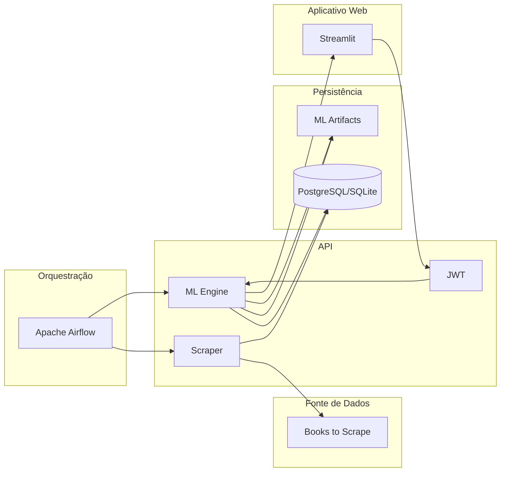

# Repositório da API para o Tech Challenge da Fase 1 da Pós-Graduação em Machine Learning Engineering da FIAP

Este repositório consiste em uma API RESTful desenvolvida com Flask, cujo objetivo consistiu no desenvolvimento de uma infraestrutura robusta para a extração, transformação e disponibilização de dados por meio de uma API pública, visando facilitar o consumo dessas informações por cientistas de dados e serviços de recomendação. Para atender aos requisitos, o desenvolvimento pautou-se na implementação de um pipeline ETL automatizado via web scraping, na construção de uma interface escalável e padronizada, na estruturação de uma arquitetura ML-ready para suporte ao ciclo de vida de modelos e na aplicação de protocolos de governança, segurança e rastreabilidade.

Como resultado, a solução consolidou a integração de rotinas de web scraping para aquisição de dados e um motor de recomendação fundamentado em processamento de linguagem natural. No que tange à infraestrutura de serviços, a API passou a dispor de segurança via JSON Web Tokens (JWT) com ciclos de renovação, otimização de performance por meio de camadas de cache e uma robusta camada de observabilidade, que persiste logs de auditoria de todas as transações no banco de dados.

### Arquitetura

O diagrama abaixo ilustra a arquitetura do projeto na sua integridade e com suas principais funcionalidades:



### Pré-requisitos

Certifique-se de ter o Python 3.11 e o Poetry instalados em seu sistema.

Para instalar o Poetry, use o método oficial:

```bash
curl -sSL https://install.python-poetry.org | python3 -
```

### Instalação

Clone o repositório e instale as dependências:

```bash
git clone https://github.com/jorgeplatero/postech-ml-techchallenge-fase-1.git
cd postech-ml-techchallenge-fase-1
poetry install
```

O Poetry criará um ambiente virtual isolado e instalará todas as bibliotecas de processamento de dados e IA necessárias.

### Como Rodar a Aplicação

**Docker:**

```bash
docker-compose up --build
```

**Local:**

1. Execute as migrações do banco de dados:

```bash
poetry run alembic upgrade head
```

2. Inicie a aplicação:

```bash
poetry run python app.py
```

A API estará rodando em http://127.0.0.1:5000/ e a documentação interativa Swagger em `/apidocs`.

## Funcionalidades

### Auth (`/api/v1/auth`)

Use estes endpoints para gerenciar o acesso à API.

- **/register**: responsável por registrar usuário e gerar par de tokens JWT
- **/login**: responsável por autenticar o usuário e gerar par de tokens JWT
- **/refresh**: responsável por gerar um novo access token a partir de um refresh token válido

### Books (`/api/v1/books`)

Endpoints para consulta e filtragem do acervo.

- **/titles**: responsável por retornar títulos de livros cadastrados
- **/details/\<book_id\>**: responsável por retornar detalhes de um livro conforme id fornecido
- **/search**: responsável por retornar lista com informações de livros conforme parâmetros fornecidos
- **/price-range**: responsável por retornar lista com informações de livros conforme faixa de preço especificada
- **/top-rated**: responsável por retornar lista com informações de livros ordenada por avaliação

### Genres (`/api/v1/genres`)

- **/**: responsável por retornar lista com gêneros de livros cadastrados

### Web Scraping

- **/scrape**: responsável pelo processo de web scraping e inserção de novos registros na tabela books

### ML (`/api/v1/ml`)

Motor de inteligência artificial para sugestão de conteúdo.

- **/features**: responsável por retornar features para treinamento
- **/training-data**: responsável por realizar o pipeline de treinamento, gerando os artefatos para recomendação de livros
- **/predictions**: responsável por retornar os 10 livros mais similares ao título especificado
- **/user-preferences/\<user_id\>**: responsável por retornar as recomendações para o usuário especificado

### Estatísticas (`/api/v1/stats`)

- **Stats Overview (/overview)**: responsável por retornar estatísticas gerais do acervo
- **Stats Genres (/genres)**: responsável por retornar estatísticas detalhadas por gênero

### Gestão (`/api/v1/health`)

- **Health (/)**: Verifica o status da API e a conectividade com o Banco de Dados.

### Tecnologias

A aplicação atua como a camada de serviço (API) que interage com o cliente, o motor de ML e o banco de dados.

| Componente | Tecnologia | Versão | Descrição |
| :--- | :--- | :--- | :--- |
| **Backend/API** | **Flask** | `>=3.1.2, <4.0.0` | Framework para o desenvolvimento de API REST |
| **ORM** | **Flask-SQLAlchemy** | `>=3.1.1, <4.0.0` | Extensão para mapeamento e manipulação de bancos de dados relacionais |
| **Autenticação** | **Flask-JWT-Extended** | `>=4.7.1, <5.0.0` | Extensão para implementação de segurança e controle de acesso via tokens JWT |
| **Criptografia** | **Flask-Bcrypt** | `>=1.0.1, <2.0.0` | Extensão de segurança para hashing e verificação robusta de senhas |
| **Performance** | **Flask-Caching** | `>=2.3.1, <3.0.0` | Extensão de otimização para implementação de camadas de cache |
| **Migrações DB** | **Alembic** | `>=1.17.2, <2.0.0` | Biblioteca de versionamento utilizada para gerenciar migrações e alterações em esquema de banco de dados |
| **Análise de Dados** | **Pandas** | `>=2.3.3, <3.0.0` | Biblioteca para manipulação de dados |
| **NLP** | **NLTK** | `>=3.9.2, <4.0.0` | Biblioteca de processamento de linguagem natural |
| **ML** | **Scikit-learn** | `>=1.7.2, <2.0.0` | Biblioteca para desenvolvimento de modelos de ML |
| **Linguagem** | **Python** | `>=3.11, <3.14` | Linguagem para desenvolvimento de scripts |
| **Infraestrutura** | **Docker** | `3.8 (Compose)` | Ferramenta de containerização para paridade entre ambientes |
| **Gerenciamento** | **Poetry** | `2.2.1` | Gerenciador de ambientes virtuais para isolamento de dependências |

### Integrações

Esta API recebe requisições de um aplicativo web desenvolvido com Streamlit e tem suas rotas `\scrape` e `*/training-data` orquestradas pelo Apache Airflow.

Link para o repositóro do aplicativo web: https://github.com/postech-mlengineering/postech-ml-techchallenge-fase-1-streamlit

Link para o repositóro do Airflow: https://github.com/postech-mlengineering/postech-ml-engineering-fase-1-techchallenge-airflow

### Deploy
